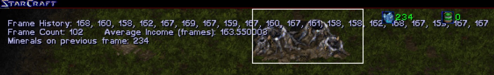
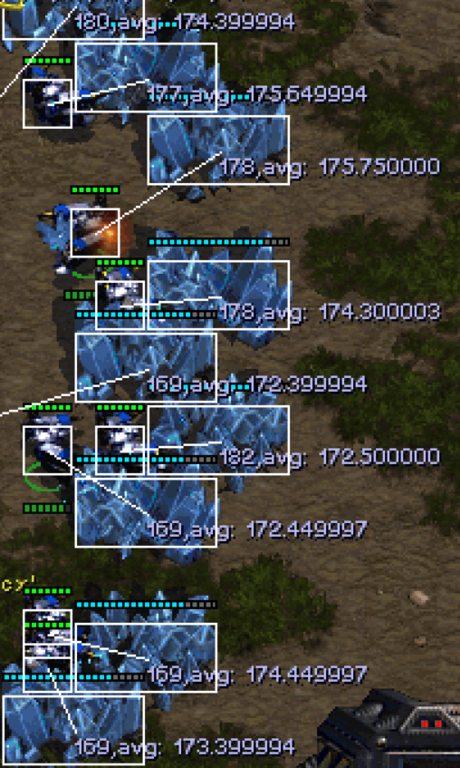
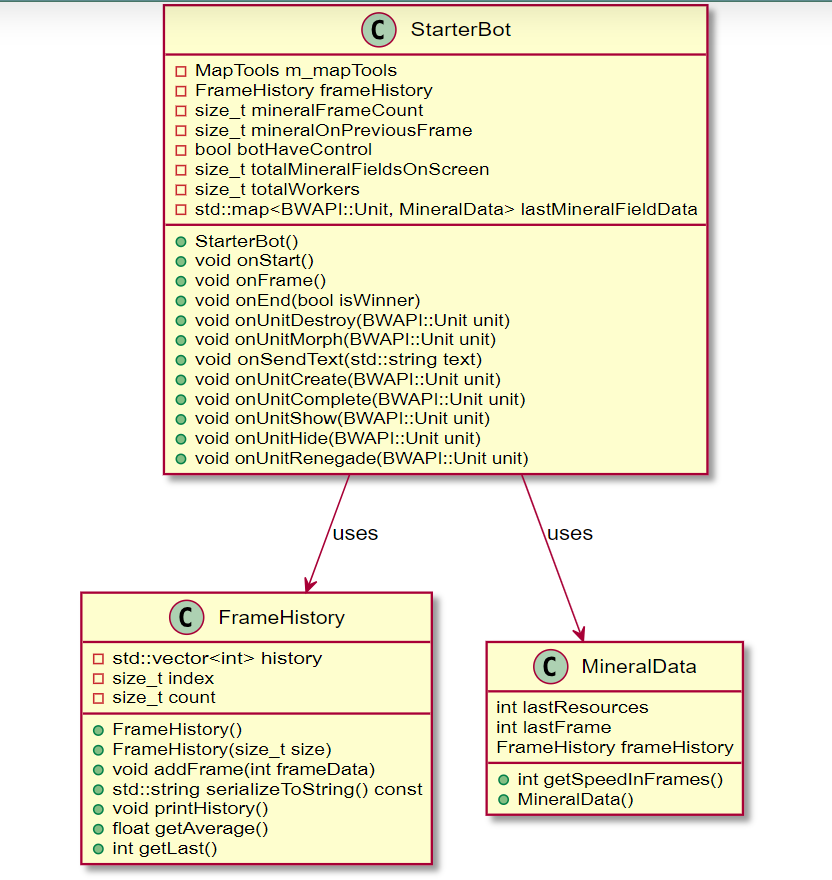
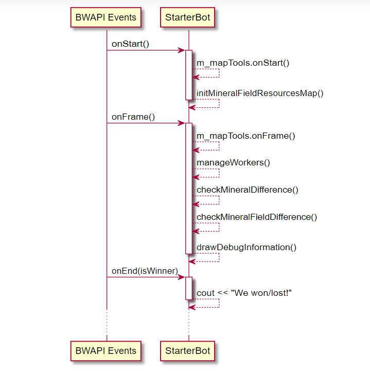

# STARTcraft

Comienza con el desarrollo de IA para Starcraft: BroodWar de la forma más rápida posible.

¿Eres nuevo en StarCraft o en la programación de IA? Mira el/los video(s) tutorial(es):
* Introducción a la IA en Starcraft: https://www.youtube.com/watch?v=czhNqUxmLks
* Tutorial de STARTcraft: https://www.youtube.com/watch?v=FEEkO6__GKw

Actualmente soportado (más opciones disponibles próximamente):
* Desarrollo en Windows / C++ usando BWAPI

# Instrucciones de Configuración:

## Windows / C++

STARTcraft viene con un StarterBot escrito en C++ utilizando BWAPI 4.4.0. Este repositorio incluye BWAPI y utiliza Injectory para lanzar StarCraft con BWAPI, por lo que no se requiere Chaoslauncher.

1. Descarga / Clona este repositorio en tu computadora.
2. Descarga y descomprime [Starcraft Broodwar 1.16.1](http://www.cs.mun.ca/~dchurchill/startcraft/scbw_bwapi440.zip) en la carpeta `starcraft` incluida.
3. Ejecuta `bin/RunC++BotAndStarcraft.bat`, lo que lanzará el ejecutable del bot y Starcraft / BWAPI.
4. Abre `visualstudio/StartCraft.sln` en Visual Studio 2022 para modificar / recompilar el código.

# Proyecto Calculo de Velocidad de Recoleccion

## Velocidad de Recoleccion

Hemos utilizado BWAPI para calcular la cantidad de frames necesarios para que un trabajador, de cualquier raza, aumente la cantidad de minerales en su tarea de recoleccion.

* Frame History : Estructura de cola, esta almacena un registro de la cantidad de frames que el trabajador necesitó las últimas 20 recolecciones.
* Frame Count : Contador de frames hasta una nueva recolección (aumento de 8 minerales).
* Average Income (Frames): Promedio del Frame History, cantidad de frames que tarda el trabajador en promedio. 
* Minerals on previous frame : Registro de la cantidad de mineral en el anterior frame

## Velocidad de Disminucion de Cada Mineral Field

Para calcular la velocidad de disminucion de cada mineral field, se utilizó BWAPI para obtener la cantidad de mineral de cada mineral field en cada frame.

* avg: A la izquierda tiene el diferencial de frames entre cada disminucion de recursos(minerales) del mineral field y la derecha el promedio de los ultimos 20 diferenciales.

## Diagrama UML

## Diagrama de Secuencia
